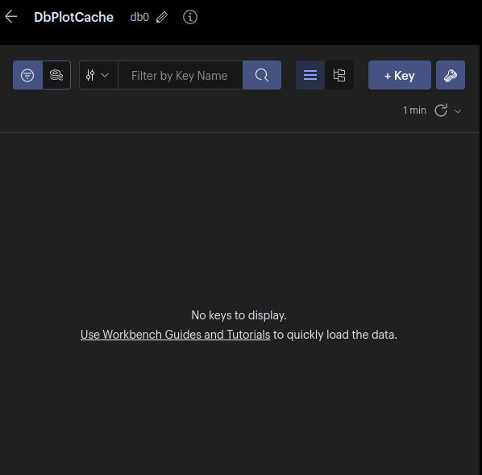
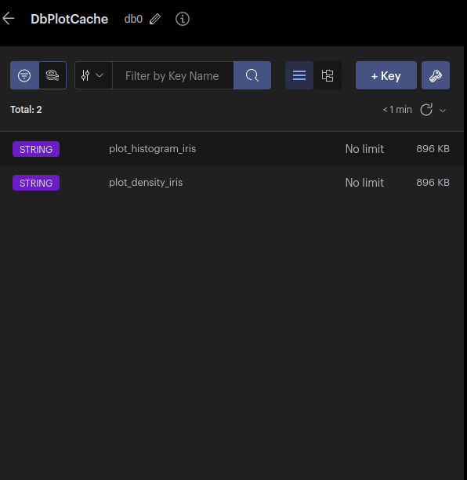
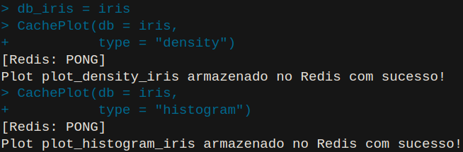
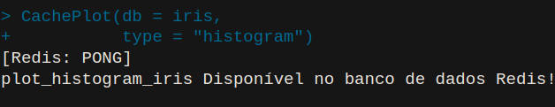

```{r setup, include=FALSE}
knitr::opts_chunk$set(echo = TRUE)
```

# Sistema de banco de dados escolhido

Entre as inúmeras opções de Sistema Gerenciador de Banco de Dados NoSQL, o Redis destaca-se quando o assunto é cache -- dado sua velocidade e mecanismo de chave-valor. Portanto, no presente projeto de Cache com plotagem gráfica, o Redis foi o escolhido. 

# Tipo de função (gráfico) para ser cacheado 

Os gráficos que serão cacheados são gráficos de distribuição, a saber: histograma e gráfico de densidade. Tais gráficos retornam a distribuoção dos dados, assim, possibilitando que o analista ou cientista de dados tome uma decisão de modelo mais apropriado de acordo com a distribuição. Por exemplo, uma distribuiçao binomial é mais apropriado em determinada modelagem estatística, por outro lado, os que têm distribuição Gaussiana se enquadra melhor em outra modelagem. A função desenvolvida em linguagem R aceita qualquer tipo de estrutura de dado numérico retornando a distribuição de acordo com o tipo de gráfico escolhido. 

# Formato dos gráficos

Os gráficos serão armazenados em formato de stringr no Redis. Como mencionando anteriormente, a função desenvovlida basicamente consegue gerar plots de qualquer dado numérico passado pelo usuário -- seja esse dado inteiro ou contínuo.  

# Qual a solução adotada para geração dos índices

Os índices foram construidos de acordo com o tipo (type) e nome da base de dados que o usuário passa como parâmetro. Por exemplo, caso o usuário escolha histogram (um gráfico de histograma) e sua base de dados é demominada "DBreceitas", gera-se um índice (chave única): **plot_histogram_DBreceitas**. O código em R: 


```{r}
# key_redis <- paste0("plot_", type, "_", base::deparse(substitute(db)))
```


# O projeto da solução: construindo a função em Linguagem R 

```{r message = F, warning = F}
# Dependências\Packages Utilizados 
library(tidyverse)
library(DataExplorer)
library(redux)
library(readxl)
```


```{r}
CachePlot <- function(db = as.data.frame(), 
                      type = as.character()){
  
# Conectando ao Redis localmente 
  redis_conn <- redux::redis_connection(redis_config()) 
  r_conex <- redux::hiredis() 
  
# Gerando a chave 
key_redis <- paste0("plot_", type, "_", base::deparse(substitute(db)))  

# Verificar se o gráfico já foi plotado anteriormente  
  
  if(r_conex$EXISTS(key_redis) == length(key_redis)){
    # Retorna o plote salvo na key-value
    print(r_conex$PING()) # Para o usuário saber se está conectado ao Redis 
    plot_redis <- base::unserialize(r_conex$GET(key = key_redis))
    cat(key_redis, "Disponível no banco de dados Redis!")
    print(plot_redis)
    
  }else{
    
# Condicional abre caso não tenha o plote no banco de dados 
  
      if(type == "histogram"){
        
        histograma = DataExplorer::plot_histogram(data = db) 
        hist_serialized = base::serialize(histograma, NULL)
        # Guardando no banco de dados 
        print(r_conex$PING())
        r_conex$SET(key = key_redis, hist_serialized)
        cat("Plot", key_redis, "armazenado no Redis com sucesso!")
        
        
      } else if(type == "density"){
        
        density = DataExplorer::plot_density(data = db)
        den_serialized = base::serialize(density, NULL)
        # Guardando no banco de dados 
        print(r_conex$PING())
        r_conex$SET(key = key_redis, den_serialized)
        cat("Plot", key_redis, "armazenado no Redis com sucesso!")
      
      } else{
        
        stop("ERRO: tipo de plote não disponível no sistema de Cache-Redis")
   
          }
        
      }
    
  }
  

```

# Chamando a Função 

Com a função desenvolvida e conectado com o banco de dados Redis, pode-se finalmente utilizar o sistema de cache. Não obstante, antes podemos visualizar o banco de dados. Note que, como esperado, o banco de dados está vazio: 


[H]   

Chamando a função que tem dois parâmetros (db e type), isto é, a base de dados e o tipo de plot, a seguir vamos testar usando a base de dados Iris como exemplo. Inicialmente com gráfico de densidade e posteriomente com histograma: 


```{r}
CachePlot(db = iris, 
          type = "density") 

CachePlot(db = iris, 
          type = "histogram") 
```

Visualizando novamente o banco de dados Redis. Percebe-se, como o esperado, que os plots foram salvos em formato de string 

[H]

Na tela do usuário retorna: 

[H]


# Funcionamento do Cache 

Pois bem, agora, caso agora a persistência no banco de dados de plot com a mesma chave, isto é, com a mesma base de dados e com o mesmo tipo, não será salvo no banco de dados, mas sim apenas buscado e retornado para o usuário. Podemos testar tentando salvar um histograma (o qual já foi salvo anteriormente):

```{r}

CachePlot(db = iris, 
          type = "density") 

```

[H]

# Conclusão 

Assim, no projeto não gerou apenas um protótipo, mas sim o desenvolvimento em linguagem R de um mecanismo de Cache que pode ser usado com qualquer dado numérico. Basta o usuário ter o banco de dados Redis Instaldo. O desenvolvimento do projeto está disponível em um repositório do Github dedicado ao projeto:https://github.com/LuizPaulo23/ProjetosPUC 


